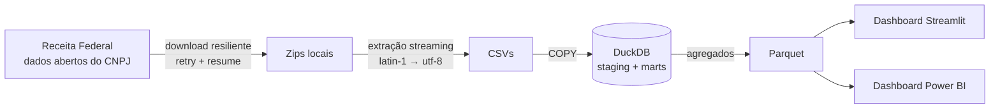

# 📡 CNPJ Radar

**Dashboard ao vivo: [cnpj-radar.streamlit.app](https://cnpj-radar.streamlit.app)**

Pipeline de engenharia de dados de ponta a ponta sobre os **dados abertos do CNPJ** da Receita Federal: o cadastro de todas as empresas do Brasil (mais de 72 milhões de estabelecimentos), atualizado mensalmente.

**Download resiliente → extração streaming → DuckDB → agregados Parquet → dashboards.**

## Arquitetura



## Por que DuckDB?

O volume (dezenas de GB descompactados) não exige um servidor de banco: o DuckDB carrega e transforma tudo localmente com performance colunar, e o resultado vira Parquet leve para os dashboards. Suporte a PostgreSQL (Docker) está no roadmap como alternativa para cenários multiusuário, e a modelagem SQL é portável.

## Como rodar

```bash
pip install -e ".[dashboard]"
cnpj-radar baixar --grupo refs               # tabelas de referência (CNAEs, municípios...)
cnpj-radar baixar --grupo estabelecimentos   # ~4,6 GB; use --arquivo p/ uma parte só
cnpj-radar schema                            # cria os schemas no DuckDB
cnpj-radar carregar --grupo refs
cnpj-radar carregar --grupo estabelecimentos
cnpj-radar transformar                       # staging -> marts + agregados
cnpj-radar exportar --remessa 2026-07-12     # Parquet + meta.json para o dashboard
streamlit run dashboard/app.py
```

Grupos disponíveis: `refs`, `empresas`, `estabelecimentos`, `socios`, `simples`. Para um arquivo específico use `--arquivo Estabelecimentos1`. O comando `cnpj-radar pastas` lista as remessas disponíveis.

## Fonte dos dados

- **Primária:** Receita Federal, no [repositório de dados abertos](https://arquivos.receitafederal.gov.br/index.php/s/YggdBLfdninEJX9) (Nextcloud/SERPRO)
- **Padrão do pipeline:** [espelho da Casa dos Dados](https://dados-abertos-rf-cnpj.casadosdados.com.br/) (CDN Cloudflare, mais estável para download automatizado), configurável via `CNPJ_BASE_URL`
- **Layout oficial:** [metadados do CNPJ (PDF)](https://www.gov.br/receitafederal/dados/cnpj-metadados.pdf)

## Estrutura

```
src/cnpj_radar/   download.py · extract.py · load.py · cli.py
sql/              schema da staging + transformações
dashboard/        app Streamlit + agregados parquet
data/             (fora do git) zips, CSVs e banco local
tests/            smoke test headless do dashboard
```

## Qualidade de dados

O comando `cnpj-radar checar` valida a carga: contagens por tabela, percentual de datas inválidas, CNAEs sem descrição na dimensão e distribuição de situação cadastral. Na remessa 2026-07-12: 69 milhões de empresas, 72,3 milhões de estabelecimentos, zero datas inválidas e zero CNAEs órfãos.

## Roadmap

- [x] Downloader com novas tentativas e retomada (HTTP Range)
- [x] Extração streaming latin-1 para UTF-8 (sem estourar memória)
- [x] Staging completa no DuckDB via COPY (escape de aspas dobradas incluso)
- [x] Modelo analítico `marts` (tipos, datas seguras, dimensões CNAE/setor/município)
- [x] Checks de qualidade de dados (`cnpj-radar checar`)
- [x] Agregados Parquet + meta (`cnpj-radar exportar`)
- [x] Dashboard Streamlit (com smoke test headless)
- [x] Carga completa da base (10/10 partes)
- [ ] Publicação do dashboard (Streamlit Community Cloud)
- [ ] Dashboard Power BI (publish to web)
- [ ] Alternativa PostgreSQL via Docker

---
*Feito por [HM DataLabs](https://www.workana.com/freelancer/60a30ff719fa6a28abc218138cd3c3f8): Mateus Camargo e Heitor Simioni. Projeto de portfólio de engenharia de dados.*
